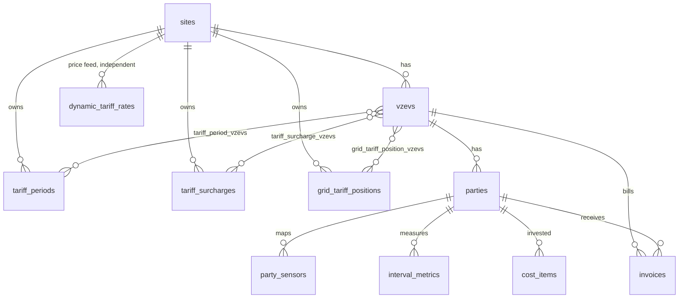

# Design proposal: several vZEVs, sensors per party

Status: proposal, nothing implemented. Written 2026-10-03.

## Goal

1. The app handles several vZEVs. A party belongs to one vZEV.
2. A tariff can be assigned to zero, one or several vZEVs.
3. A mapped sensor belongs to a party of a vZEV, not to the site. The
   dynamic feed-in price sensor is the exception and stays independent.
4. In the user management tab an admin adds a metric to a party: pick a
   type from the available ones, then map a sensor to it.
5. As a result a vZEV can hold several parties that produce.

## Where the model stands today

- `sites` is three things at once: the installation (Home Assistant link,
  time zone), the one implicit vZEV, and the one implicit producer (its
  live sensors, battery loss, production start, investment).
- `parties` hang off the site. One of them is the administrator.
- `ha_entity_map` holds one sensor per `(site, metric_kind)`.
- `interval_metrics` has two populations. Rows with `party_id NULL` are
  the producer's: production, inverter, battery, grid import and export,
  own load. Rows with a party are consumption only (`consumption`,
  `consumption_grid`).
- Tariff periods, surcharges, grid tariff positions, dynamic rates, cost
  items and invoices all carry `site_id`.

The producer is never named. Every reader that wants "the plant" asks for
rows where the party is null. That is the assumption this change removes.

## Proposed model

### `sites` stays, as the installation

One Home Assistant, one time zone, one operator account. It keeps
`name`, `timezone`, `dynamic_tariff_entity_id` and nothing else about
energy. `dynamic_tariff_rates` stays keyed by site: that is the
independent price feed, and any vZEV whose feed-in period is `dynamic`
reads it.

A site is kept above the vZEV, rather than renaming `sites` to `vzevs`,
because a tariff shared between vZEVs needs an owner that is neither of
them.

### New `vzevs`

| Column | Note |
|---|---|
| `id` | |
| `site_id` | cascade |
| `name` | unique per site |
| `reference` | the grid operator's number for the vZEV, optional |
| `drive_folder_id`, `drive_folder_name` | moved from `sites`: invoices are archived per vZEV |
| `created_at`, `updated_at` | |

### `parties`

- `site_id` is replaced by `vzev_id` (not null, cascade).
- Name is unique per vZEV. The one-administrator rule becomes one per
  vZEV: that party is the vZEV's representative and its QR-bill payee.
- Gains the plant attributes that sit on `sites` today:
  `production_start_date` and `battery_conversion_loss`, both nullable. A
  party that has neither a PV nor a battery sensor leaves them empty.
- A person in two vZEVs is two party rows.

### `party_sensors`, replacing `ha_entity_map` and the `live_*` columns

One list per party. This is the table behind "add a metric, pick its
type, map the sensor".

| Column | Note |
|---|---|
| `id` | |
| `party_id` | not null, cascade |
| `kind` | see the catalogue below |
| `entity_id` | Home Assistant statistic or entity id |
| `inverted` | the sensor reads negative in the direction the kind names. Replaces `live_export_negative` and `live_battery_charge_negative` |
| `enabled` | |
| unique | `(party_id, kind)` |

Catalogue of kinds an admin can pick:

| Kind | Read as | Stored |
|---|---|---|
| `pv_dc`, `inverter_ac`, `battery_charge`, `battery_discharge` | energy counter | `interval_metrics` |
| `export_local` | energy leaving the party's connection | `interval_metrics` |
| `import_grid` | energy drawn at the party's connection | `interval_metrics` |
| `consumption_own` | the party's own load | `interval_metrics` |
| `live_pv_power`, `live_grid_power`, `live_battery_power`, `live_load_power`, `live_battery_soc` | read on demand | never |
| `forecast_today`, `forecast_remaining`, `forecast_tomorrow` | read on demand | never |

`production` and `battery_discharge_ac` stay derived, now per party, by
the existing inverter split. `consumption`, `consumption_grid` and
`export_grid` are allocation results, not sensors: see the open question
on allocation.

Folding the live and forecast sensors into the same table is what makes
the user-management list one list. The alternative is to keep
`ha_entity_map` for energy counters and add a second per-party table for
live sensors. It works, but the admin then maps a party's sensors in two
places.

### `interval_metrics`

- `party_id` becomes not null. Every row belongs to a party.
- The two partial unique indexes collapse into one on
  `(site_id, ts, metric_kind, party_id)`.
- No `vzev_id` column. The vZEV is the party's, and the party table is
  tiny, so the join costs nothing and a party cannot drift out of step
  with its rows.
- The enum is not changed. Renaming values on a hypertable buys nothing;
  the meanings are restated per party instead.

### Tariffs, zero to many vZEVs

Three join tables, each a pair of foreign keys with cascade on both
sides:

- `tariff_period_vzevs (tariff_period_id, vzev_id)`
- `tariff_surcharge_vzevs (tariff_surcharge_id, vzev_id)`
- `grid_tariff_position_vzevs (grid_tariff_position_id, vzev_id)`

The tariff rows keep `site_id` as their owner. A tariff with no vZEV is a
template: stored, applied nowhere. The overlap rule moves with the
assignment: two periods of the same kind may overlap in time as long as
no vZEV is assigned both. That is checked in the service when a period
or an assignment is saved, as the overlap check is today.

### `cost_items` and `invoices`

- `cost_items` gains `party_id`: an investment belongs to the party that
  owns the plant. Payback is then per producing party.
- `invoices` gains `vzev_id`, snapshotted like the party name. A batch is
  one vZEV and one period.

## Migration

All steps are additive first, so the app keeps running on one vZEV until
the readers are switched.

1. Create `vzevs`. Insert one per site, named after it. Add
   `parties.vzev_id`, backfill, set not null, swap the two party indexes.
2. Create the three tariff join tables. Link every existing tariff row to
   the default vZEV, so pricing is unchanged.
3. Name the producer. For each site, the `rcp_admin` party takes over the
   site-level rows. A site whose admin is `rcp_admin_only`, or that has
   none, gets a new party called "Producer" for the admin to rename.
4. Create `party_sensors` from `ha_entity_map` and from the `live_*` and
   `forecast_*` columns, all on the producer party. Copy
   `production_start_date` and `battery_conversion_loss` to it. Set
   `cost_items.party_id` to it.
5. Backfill `interval_metrics.party_id` on the null rows, then set not
   null and replace the two partial indexes with one. About 75,000 rows
   here. Compression is off, so a plain update works. The migration
   checks first that the producer has no row of the same kind and
   timestamp. Today it has none: its only per-party rows are
   `consumption_grid`, from the test seed.
6. Drop `ha_entity_map`, the moved `sites` columns and `parties.site_id`
   once nothing reads them.

Step 5 is a hand-written migration, as the hypertable indexes already
are.

## What it touches beyond the schema

- **Readers of "site-level" rows.** Thirteen places filter on a null
  party, across savings, live view, the Home Assistant sync and split,
  readings import and export, community, consumption and billing. Each
  becomes "this party" or "the producers of this vZEV".
- **Routes and access.** Most `/api/sites/:siteId/...` routes become
  `/api/vzevs/:vzevId/...` or `/api/parties/:partyId/...`. A participant
  is confined to their own vZEV.
- **Dashboard and Consumption.** Savings, payback and the live radial
  describe one plant. They need a scope: which vZEV, and within it which
  producing party or all of them.
- **Readings import.** The CSV's `party` column becomes required for
  every kind.
- **Seed data.** The Q1 2027 test seed is all site-level and would be
  migrated onto the producer. Wiping it first is simpler.

## Open questions

These change the design, so they are yours to decide. Each has the
option the proposal assumes.

1. **Allocation with several producers.** Today the owner is the only
   source, so "sold to participants" is simply what they consumed
   locally. With two producers, each interval needs a rule for whose
   export covered whose draw. Either the grid operator's allocation is
   imported per party, or the app computes it pro rata per quarter hour.
   Assumed: imported where available, pro rata otherwise. This is the
   largest piece of engine work and is not a schema question.
2. **Who is paid.** One representative bills the participants. With
   several producers the local revenue has to be shared between them.
   Assumed: the representative stays the only payee, and a per-producer
   settlement statement comes later.
3. **Feed-in tariff per producer.** Each producer has their own contract
   with the buyer, so two producers in one vZEV may have different
   feed-in terms. Assumed: tariffs are per vZEV as you asked. If
   contracts differ, feed-in periods need a party assignment as well.
4. **Administrator scope.** Assumed: any administrator manages every
   vZEV of the site, and participants see only their own. Per-vZEV
   administrators would need a role check on every admin route.
5. **One e-mail in two vZEVs.** Sign-in resolves an address to one
   party. Assumed: an address is unique across parties, enforced on
   save. The alternative is a vZEV switcher for that user.
6. **Several sensors of one kind.** Two inverters on one party would need
   two `inverter_ac` rows. Assumed: one sensor per kind per party, and a
   second inverter is summed in Home Assistant.

## Suggested order

1. Schema steps 1 and 2 with the vZEV and tariff-assignment screens. One
   vZEV, no behaviour change.
2. Steps 3 to 6 with the per-party sensor list in user management. Still
   one producer, but named.
3. Second producer in a vZEV: per-party split, allocation, per-party
   savings.
4. Second vZEV: switcher, scoped routes and access.
